## 《实验一：索引&文档操作》

***

> **学院：省级示范性软件学院**
>
> **题目：《实验一：索引&文档操作》**
>
> **姓名：刘顺文**
>
> **学号：2200770061**
>
> **班级：软工2202**
>
> **日期：2024-09-21**
>
> **实验环境：Elasticsearch**

***
## 一、实验目的：
> **1、掌握Elasticsearch 安装IK分词器的安装方法**
>
> **2、掌握Elasticsearch 索引操作方法**
>
> **3、掌握Elasticsearch 文档操作训练**
>
> **4、Elasticsearch 高级查询与DSL训练**
***
## 二、实验内容：
### 1、索引操作练习：
#### 1.1.用户信息(User Information)索引
- ==**代码：**==
> 使用PUT请求创建索引
``` json
PUT /user_information
{
  "mappings": {
    "properties": {
      "user_id": {
        "type": "keyword"
      },
      "name": {
        "type": "text"
      },
      "email": {
        "type": "keyword"
      },
      "data_of_birth": {
        "type": "date"
      },
      "gender": {
        "type": "keyword"
      },
      "address": {
        "type": "text"
      },
      "phone_number": {
        "type": "keyword"
      },
      "registration_date": {
        "type": "date"
      },
      "last_login": {
        "type": "date"
      },
      "status": {
        "type": "keyword"
      }
    }
  }
}
```
- ==**成功操作截图：**==
> 使用GET请求看到索引已创建
> 

***
#### 1.2.产品目录(Product Catalog)索引
- ==**代码：**==
> 使用PUT请求创建索引
``` json
PUT /product_catalog
{
  "mappings": {
    "properties": {
      "product_id": {
        "type": "keyword"
      },
      "name": {
        "type": "text"
      },
      "description": {
        "type": "text"
      },
      "category": {
        "type": "keyword"
      },
      "price": {
        "type": "double"
      },
      "stock_quantity": {
        "type": "integer"
      },
      "supplier": {
        "type": "keyword"
      },
      "release_date": {
        "type": "date"
      },
      "tags": {
        "type": "keyword"
      },
      "rating": {
        "type": "float"
      }
    }
  }
}
```
- ==**成功操作截图：**==
> 使用GET请求看到索引已创建
> 

***
#### 1.3.订单记录(Order Records)索引
- ==**代码：**==
> 使用PUT请求创建索引
``` json
PUT /order_records
{
  "mappings": {
    "properties": {
      "order_id": {
        "type": "keyword"
      },
      "customer_id": {
        "type": "keyword"
      },
      "order_date": {
        "type": "date"
      },
      "status": {
        "type": "keyword"
      },
      "total_amount": {
        "type": "double"
      },
      "items": {
        "type": "nested"
      },
      "shipping_address": {
        "type": "text"
      },
      "payment_method": {
        "type": "keyword"
      },
      "shipping_date": {
        "type": "date"
      },
      "delivery_date": {
        "type": "date"
      }
    }
  }
}
```
- ==**成功操作截图：**==
> 使用GET请求看到索引已创建
> 
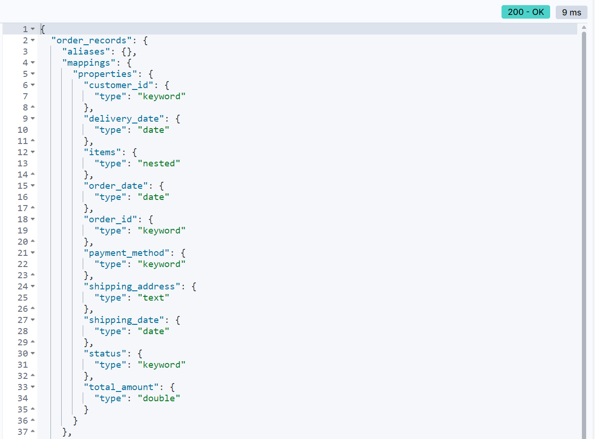
***
#### 1.4.修改索引
- ==**代码：**==
> 使用PUT请求添加映射字段
``` json
PUT /user_information/_mapping
{
  "properties": {
    "user_age": {
      "type": "integer"
    }
  }
}
```
- ==**成功操作截图：**==
> 使用GET请求看到映射字段已添加
> 
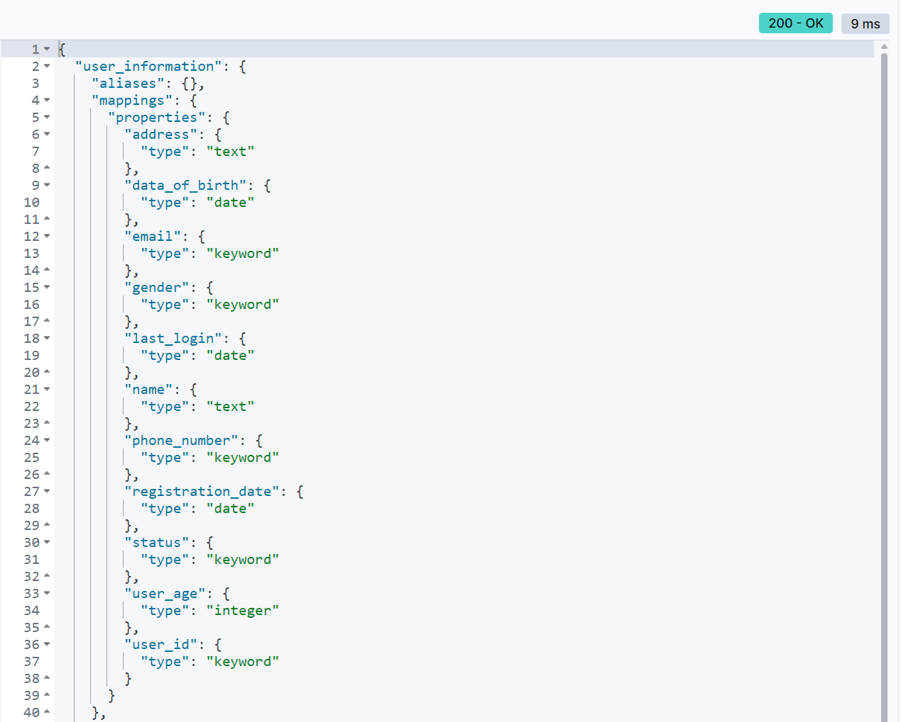
***
#### 1.5.删除索引
- ==**代码：**==
> 使用DELETE删除索引
``` json
DELETE /user_information
```
- ==**成功操作截图：**==
> 使用GET请求发现找不到索引，证明索引已被删除
> 
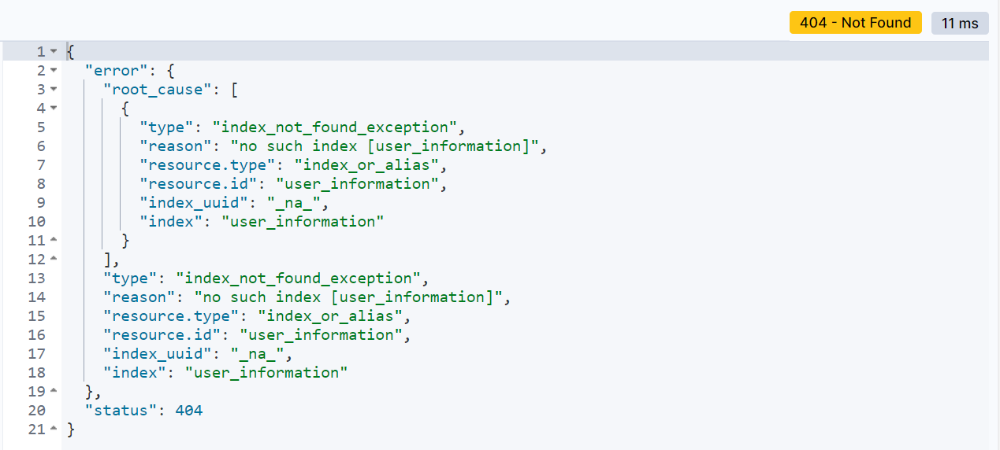
***
### 2、文档操作练习：
#### 2.1.用户信息数据
- ==**代码：**==
> 使用POST请求将数据批量导入ES数据库中
``` json
POST /user_information/_bulk
{ "index": { "_id": "001" }}
{ "user_id": "001", "name": "Alice Johnson", "email": "alice.johnson@example.com", "date_of_birth": "1990-05-15", "gender": "female", "address": "123 Main St, Anytown, USA", "phone_number": "123-456-7890", "registration_date": "2023-01-15", "last_login": "2024-09-01", "status": "active" }
{ "index": { "_id": "002" }}
{ "user_id": "002", "name": "Bob Smith", "email": "bob.smith@example.com", "date_of_birth": "1985-08-20", "gender": "male", "address": "456 Elm St, Othertown, USA", "phone_number": "234-567-8901", "registration_date": "2023-02-20", "last_login": "2024-08-25", "status": "active" }
{ "index": { "_id": "003" }}
{ "user_id": "003", "name": "Charlie Brown", "email": "charlie.brown@example.com", "date_of_birth": "1992-11-30", "gender": "male", "address": "789 Maple Ave, Sometown, USA", "phone_number": "345-678-9012", "registration_date": "2023-03-10", "last_login": "2024-09-05", "status": "inactive" }
{ "index": { "_id": "004" }}
{ "user_id": "004", "name": "David Wilson", "email": "david.wilson@example.com", "date_of_birth": "1988-02-14", "gender": "male", "address": "101 Oak St, Anycity, USA", "phone_number": "456-789-0123", "registration_date": "2023-04-05", "last_login": "2024-08-30", "status": "active" }
{ "index": { "_id": "005" }}
{ "user_id": "005", "name": "Eve Davis", "email": "eve.davis@example.com", "date_of_birth": "1995-07-22", "gender": "female", "address": "202 Pine St, Otherville, USA", "phone_number": "567-890-1234", "registration_date": "2023-05-18", "last_login": "2024-09-02", "status": "active" }
{ "index": { "_id": "006" }}
{ "user_id": "006", "name": "Frank Miller", "email": "frank.miller@example.com", "date_of_birth": "1991-10-05", "gender": "male", "address": "303 Cedar Rd, Newtown, USA", "phone_number": "678-901-2345", "registration_date": "2023-06-22", "last_login": "2024-09-03", "status": "active" }
{ "index": { "_id": "007" }}
{ "user_id": "007", "name": "Grace Lee", "email": "grace.lee@example.com", "date_of_birth": "1989-04-17", "gender": "female", "address": "404 Birch Ln, Oldtown, USA", "phone_number": "789-012-3456", "registration_date": "2023-07-30", "last_login": "2024-09-04", "status": "inactive" }
{ "index": { "_id": "008" }}
{ "user_id": "008", "name": "Hannah White", "email": "hannah.white@example.com", "date_of_birth": "1993-12-25", "gender": "female", "address": "505 Spruce St, Littletown, USA", "phone_number": "890-123-4567", "registration_date": "2023-08-15", "last_login": "2024-09-06", "status": "active" }
{ "index": { "_id": "009" }}
{ "user_id": "009", "name": "Ivy Green", "email": "ivy.green@example.com", "date_of_birth": "1994-03-03", "gender": "female", "address": "606 Willow Ave, Bigcity, USA", "phone_number": "901-234-5678", "registration_date": "2023-09-01", "last_login": "2024-09-07", "status": "active" }
{ "index": { "_id": "010" }}
{ "user_id": "010", "name": "Jack Black", "email": "jack.black@example.com", "date_of_birth": "1987-06-18", "gender": "male", "address": "707 Poplar Dr, Smalltown, USA", "phone_number": "012-345-6789", "registration_date": "2023-10-10", "last_login": "2024-09-08", "status": "inactive" }
{ "index": { "_id": "011" }}
{ "user_id": "011", "name": "Karen Adams", "email": "karen.adams@example.com", "date_of_birth": "1990-09-21", "gender": "female", "address": "808 Chestnut Blvd, Metropolis, USA", "phone_number": "123-456-7890", "registration_date": "2023-11-25", "last_login": "2024-09-09", "status": "active" }
{ "index": { "_id": "012" }}
{ "user_id": "012", "name": "Leo King", "email": "leo.king@example.com", "date_of_birth": "1986-01-12", "gender": "male", "address": "909 Ash Ct, Villagetown, USA", "phone_number": "234-567-8901", "registration_date": "2023-12-05", "last_login": "2024-09-10", "status": "active" }
{ "index": { "_id": "013" }}
{ "user_id": "013", "name": "Mia Moore", "email": "mia.moore@example.com", "date_of_birth": "1992-02-28", "gender": "female", "address": "1010 Fir Ln, Hamlet, USA", "phone_number": "345-678-9012", "registration_date": "2024-01-10", "last_login": "2024-09-11", "status": "inactive" }
{ "index": { "_id": "014" }}
{ "user_id": "014", "name": "Nina Scott", "email": "nina.scott@example.com", "date_of_birth": "1988-05-05", "gender": "female", "address": "1111 Cypress St, Township, USA", "phone_number": "456-789-0123", "registration_date": "2024-02-14", "last_login": "2024-09-12", "status": "active" }
{ "index": { "_id": "015" }}
{ "user_id": "015", "name": "Oscar Turner", "email": "oscar.turner@example.com", "date_of_birth": "1991-07-19", "gender": "male", "address": "1212 Redwood Rd, Cityville, USA", "phone_number": "567-890-1234", "registration_date": "2024-03-20", "last_login": "2024-09-13", "status": "active" }
{ "index": { "_id": "016" }}
{ "user_id": "016", "name": "Paul Walker", "email": "paul.walker@example.com", "date_of_birth": "1989-10-10", "gender": "male", "address": "1313 Cherry Ave, Urbantown, USA", "phone_number": "678-901-2345", "registration_date": "2024-04-25", "last_login": "2024-09-14", "status": "inactive" }
{ "index": { "_id": "017" }}
{ "user_id": "017", "name": "Quinn Young", "email": "quinn.young@example.com", "date_of_birth": "1994-12-01", "gender": "male", "address": "1414 Aspen Blvd, Countryside, USA", "phone_number": "789-012-3456", "registration_date": "2024-05-15", "last_login": "2024-09-15", "status": "active" }
{ "index": { "_id": "018" }}
{ "user_id": "018", "name": "Rachel Hall", "email": "rachel.hall@example.com", "date_of_birth": "1995-03-17", "gender": "female", "address": "1515 Magnolia Dr, Rivertown, USA", "phone_number": "890-123-4567", "registration_date": "2024-06-22", "last_login": "2024-09-16", "status": "active" }
{ "index": { "_id": "019" }}
{ "user_id": "019", "name": "Sam Mitchell", "email": "sam.mitchell@example.com", "date_of_birth": "1993-08-08", "gender": "male", "address": "1616 Dogwood St, Beachtown, USA", "phone_number": "901-234-5678", "registration_date": "2024-07-30", "last_login": "2024-09-17", "status": "inactive" }
{ "index": { "_id": "020" }}
{ "user_id": "020", "name": "Tina Baker", "email": "tina.baker@example.com", "date_of_birth": "1990-11-11", "gender": "female", "address": "1717 Pinecone Rd, Mountaintown, USA", "phone_number": "012-345-6789", "registration_date": "2024-08-18", "last_login": "2024-09-18", "status": "active" }
```
- ==**成功操作截图：**==

***
#### 2.2.产品目录数据
- ==**代码：**==
> 使用POST请求将数据批量导入ES数据库中
``` json
POST /product_catalog/_bulk
{ "index": { "_id": "P001" } }
{ "product_id": "P001", "name": "Wireless Mouse", "description": "A high precision wireless mouse with ergonomic design.", "category": "Electronics", "price": 29.99, "stock_quantity": 150, "supplier": "TechCorp", "release_date": "2023-01-15", "tags": ["wireless", "mouse", "electronics"], "rating": 4.5 }
{ "index": { "_id": "P002" } }
{ "product_id": "P002", "name": "Bluetooth Speaker", "description": "Portable Bluetooth speaker with excellent sound quality.", "category": "Audio", "price": 49.99, "stock_quantity": 200, "supplier": "SoundWave", "release_date": "2023-02-20", "tags": ["bluetooth", "speaker", "audio"], "rating": 4.7 }
{ "index": { "_id": "P003" } }
{ "product_id": "P003", "name": "Smartphone Stand", "description": "Adjustable smartphone stand for hands-free viewing.", "category": "Accessories", "price": 15.99, "stock_quantity": 300, "supplier": "GadgetPlus", "release_date": "2023-03-10", "tags": ["smartphone", "stand", "accessories"], "rating": 4.3 }
{ "index": { "_id": "P004" } }
{ "product_id": "P004", "name": "USB-C Charger", "description": "Fast charging USB-C charger compatible with most devices.", "category": "Chargers", "price": 19.99, "stock_quantity": 250, "supplier": "ChargeMaster", "release_date": "2023-04-05", "tags": ["usb-c", "charger", "electronics"], "rating": 4.6 }
{ "index": { "_id": "P005" } }
{ "product_id": "P005", "name": "Noise Cancelling Headphones", "description": "Over-ear headphones with active noise cancellation.", "category": "Audio", "price": 89.99, "stock_quantity": 100, "supplier": "AudioTech", "release_date": "2023-05-18", "tags": ["noise cancelling", "headphones", "audio"], "rating": 4.8 }
{ "index": { "_id": "P006" } }
{ "product_id": "P006", "name": "4K Monitor", "description": "Ultra HD 4K monitor with stunning display quality.", "category": "Monitors", "price": 299.99, "stock_quantity": 80, "supplier": "ViewPerfect", "release_date": "2023-06-22", "tags": ["4k", "monitor", "electronics"], "rating": 4.9 }
{ "index": { "_id": "P007" } }
{ "product_id": "P007", "name": "Gaming Keyboard", "description": "Mechanical keyboard with customizable RGB lighting.", "category": "Gaming", "price": 59.99, "stock_quantity": 120, "supplier": "GameGear", "release_date": "2023-07-30", "tags": ["gaming", "keyboard", "electronics"], "rating": 4.4 }
{ "index": { "_id": "P008" } }
{ "product_id": "P008", "name": "Fitness Tracker", "description": "Smart fitness tracker with heart rate monitor.", "category": "Wearables", "price": 39.99, "stock_quantity": 180, "supplier": "FitLife", "release_date": "2023-08-15", "tags": ["fitness", "tracker", "wearables"], "rating": 4.2 }
{ "index": { "_id": "P009" } }
{ "product_id": "P009", "name": "Electric Toothbrush", "description": "Rechargeable electric toothbrush with multiple modes.", "category": "Personal Care", "price": 34.99, "stock_quantity": 140, "supplier": "SmileBright", "release_date": "2023-09-01", "tags": ["electric", "toothbrush", "personal care"], "rating": 4.5 }
{ "index": { "_id": "P010" } }
{ "product_id": "P010", "name": "Smart Thermostat", "description": "Wi-Fi enabled smart thermostat with energy saving features.", "category": "Home Automation", "price": 129.99, "stock_quantity": 90, "supplier": "HomeSmart", "release_date": "2023-10-10", "tags": ["smart", "thermostat", "home automation"], "rating": 4.7 }
{ "index": { "_id": "P011" } }
{ "product_id": "P011", "name": "LED Desk Lamp", "description": "Adjustable LED desk lamp with touch control.", "category": "Lighting", "price": 24.99, "stock_quantity": 160, "supplier": "BrightLight", "release_date": "2023-11-25", "tags": ["led", "desk lamp", "lighting"], "rating": 4.3 }
{ "index": { "_id": "P012" } }
{ "product_id": "P012", "name": "Portable Hard Drive", "description": "1TB portable hard drive with fast data transfer.", "category": "Storage", "price": 64.99, "stock_quantity": 110, "supplier": "DataSafe", "release_date": "2023-12-05", "tags": ["portable", "hard drive", "storage"], "rating": 4.6 }
{ "index": { "_id": "P013" } }
{ "product_id": "P013", "name": "Coffee Maker", "description": "Automatic coffee maker with programmable settings.", "category": "Kitchen Appliances", "price": 79.99, "stock_quantity": 130, "supplier": "BrewMaster", "release_date": "2024-01-10", "tags": ["coffee", "maker", "appliances"], "rating": 4.4 }
{ "index": { "_id": "P014" } }
{ "product_id": "P014", "name": "Smart Light Bulb", "description": "Color changing smart light bulb with app control.", "category": "Lighting", "price": 14.99, "stock_quantity": 220, "supplier": "LightSmart", "release_date": "2024-02-14", "tags": ["smart", "light bulb", "lighting"], "rating": 4.2 }
{ "index": { "_id": "P015" } }
{ "product_id": "P015", "name": "Electric Kettle", "description": "Quick boil electric kettle with auto shut-off.", "category": "Kitchen Appliances", "price": 29.99, "stock_quantity": 170, "supplier": "QuickBoil", "release_date": "2024-03-20", "tags": ["electric", "kettle", "appliances"], "rating": 4.5 }
{ "index": { "_id": "P016" } }
{ "product_id": "P016", "name": "Robot Vacuum", "description": "Smart robot vacuum cleaner with scheduling features.", "category": "Home Appliances", "price": 199.99, "stock_quantity": 60, "supplier": "CleanBot", "release_date": "2024-04-25", "tags": ["robot", "vacuum", "home appliances"], "rating": 4.8 }
{ "index": { "_id": "P017" } }
{ "product_id": "P017", "name": "Digital Camera", "description": "Compact digital camera with high resolution.", "category": "Photography", "price": 149.99, "stock_quantity": 95, "supplier": "PhotoSnap", "release_date": "2024-05-30", "tags": ["digital", "camera", "photography"], "rating": 4.7 }
{ "index": { "_id": "P018" } }
{ "product_id": "P018", "name": "Smartwatch", "description": "Feature-rich smartwatch with fitness tracking.", "category": "Wearables", "price": 99.99, "stock_quantity": 140, "supplier": "WristTech", "release_date": "2024-06-15", "tags": ["smartwatch", "wearables", "fitness"], "rating": 4.4 }
{ "index": { "_id": "P019" } }
{ "product_id": "P019", "name": "Air Fryer", "description": "Healthier cooking with a digital air fryer.", "category": "Kitchen Appliances", "price": 89.99, "stock_quantity": 115, "supplier": "HealthyCook", "release_date": "2024-07-20", "tags": ["air fryer", "kitchen", "appliances"], "rating": 4.6 }
{ "index": { "_id": "P020" } }
{ "product_id": "P020", "name": "Electric Scooter", "description": "Eco-friendly electric scooter with long battery life.", "category": "Transportation", "price": 299.99, "stock_quantity": 50, "supplier": "EcoRide", "release_date": "2024-08-10", "tags": ["electric", "scooter", "transportation"], "rating": 4.7 }
```
- ==**成功操作截图：**== 

***
#### 2.3.订单记录数据
- ==**代码：**==
> 使用POST请求将数据批量导入ES数据库中
``` json
POST /order_records/_bulk
{ "index": { "_id": "OR001" } }
{ "order_id": "OR001", "customer_id": "C001", "order_date": "2024-01-10", "status": "completed", "total_amount": 150.75, "items": [{ "product_id": "P001", "quantity": 2, "price": 50.00 }, { "product_id": "P002", "quantity": 1, "price": 50.75 }], "shipping_address": "123 Main St, Anytown, USA", "payment_method": "credit_card", "shipping_date": "2024-01-11", "delivery_date": "2024-01-15" }
{ "index": { "_id": "OR002" } }
{ "order_id": "OR002", "customer_id": "C002", "order_date": "2024-01-15", "status": "pending", "total_amount": 89.99, "items": [{ "product_id": "P003", "quantity": 1, "price": 89.99 }], "shipping_address": "456 Elm St, Othertown, USA", "payment_method": "paypal", "shipping_date": "2024-01-16", "delivery_date": "2024-01-20" }
{ "index": { "_id": "OR003" } }
{ "order_id": "OR003", "customer_id": "C003", "order_date": "2024-01-20", "status": "shipped", "total_amount": 120.50, "items": [{ "product_id": "P004", "quantity": 3, "price": 40.00 }], "shipping_address": "789 Maple Ave, Sometown, USA", "payment_method": "debit_card", "shipping_date": "2024-01-21", "delivery_date": "2024-01-25" }
{ "index": { "_id": "OR004" } }
{ "order_id": "OR004", "customer_id": "C004", "order_date": "2024-01-25", "status": "completed", "total_amount": 75.00, "items": [{ "product_id": "P005", "quantity": 5, "price": 15.00 }], "shipping_address": "101 Oak St, Anycity, USA", "payment_method": "credit_card", "shipping_date": "2024-01-26", "delivery_date": "2024-01-30" }
{ "index": { "_id": "OR005" } }
{ "order_id": "OR005", "customer_id": "C005", "order_date": "2024-02-01", "status": "cancelled", "total_amount": 200.00, "items": [{ "product_id": "P006", "quantity": 2, "price": 100.00 }], "shipping_address": "202 Pine St, Otherville, USA", "payment_method": "bank_transfer", "shipping_date": "2024-02-02", "delivery_date": "2024-02-06" }
{ "index": { "_id": "OR006" } }
{ "order_id": "OR006", "customer_id": "C006", "order_date": "2024-02-05", "status": "completed", "total_amount": 300.25, "items": [{ "product_id": "P007", "quantity": 1, "price": 300.25 }], "shipping_address": "303 Cedar Rd, Newtown, USA", "payment_method": "credit_card", "shipping_date": "2024-02-06", "delivery_date": "2024-02-10" }
{ "index": { "_id": "OR007" } }
{ "order_id": "OR007", "customer_id": "C007", "order_date": "2024-02-10", "status": "pending", "total_amount": 45.99, "items": [{ "product_id": "P008", "quantity": 3, "price": 15.33 }], "shipping_address": "404 Birch Ln, Oldtown, USA", "payment_method": "paypal", "shipping_date": "2024-02-11", "delivery_date": "2024-02-15" }
{ "index": { "_id": "OR008" } }
{ "order_id": "OR008", "customer_id": "C008", "order_date": "2024-02-15", "status": "shipped", "total_amount": 89.50, "items": [{ "product_id": "P009", "quantity": 2, "price": 44.75 }], "shipping_address": "505 Spruce St, Littletown, USA", "payment_method": "debit_card", "shipping_date": "2024-02-16", "delivery_date": "2024-02-20" }
{ "index": { "_id": "OR009" } }
{ "order_id": "OR009", "customer_id": "C009", "order_date": "2024-02-20", "status": "completed", "total_amount": 60.00, "items": [{ "product_id": "P010", "quantity": 4, "price": 15.00 }], "shipping_address": "606 Willow Ave, Bigcity, USA", "payment_method": "credit_card", "shipping_date": "2024-02-21", "delivery_date": "2024-02-25" }
{ "index": { "_id": "OR010" } }
{ "order_id": "OR010", "customer_id": "C010", "order_date": "2024-02-25", "status": "cancelled", "total_amount": 150.00, "items": [{ "product_id": "P011", "quantity": 10, "price": 15.00 }], "shipping_address": "707 Poplar Dr, Smalltown, USA", "payment_method": "bank_transfer", "shipping_date": "2024-02-26", "delivery_date": "2024-03-01" }
{ "index": { "_id": "OR011" } }
{ "order_id": "OR011", "customer_id": "C011", "order_date": "2024-03-01", "status": "completed", "total_amount": 110.00, "items": [{ "product_id": "P012", "quantity": 2, "price": 55.00 }], "shipping_address": "808 Chestnut Blvd, Metropolis, USA", "payment_method": "credit_card", "shipping_date": "2024-03-02", "delivery_date": "2024-03-06" }
{ "index": { "_id": "OR012" } }
{ "order_id": "OR012", "customer_id": "C012", "order_date": "2024-03-05", "status": "pending", "total_amount": 75.99, "items": [{ "product_id": "P013", "quantity": 3, "price": 25.33 }], "shipping_address": "909 Ash Ct, Villagetown, USA", "payment_method": "paypal", "shipping_date": "2024-03-06", "delivery_date": "2024-03-10" }
{ "index": { "_id": "OR013" } }
{ "order_id": "OR013", "customer_id": "C013", "order_date": "2024-03-10", "status": "shipped", "total_amount": 200.00, "items": [{ "product_id": "P014", "quantity": 4, "price": 50.00 }], "shipping_address": "1010 Fir Ln, Hamlet, USA", "payment_method": "debit_card", "shipping_date": "2024-03-11", "delivery_date": "2024-03-15" }
{ "index": { "_id": "OR014" } }
{ "order_id": "OR014", "customer_id": "C014", "order_date": "2024-03-15", "status": "completed", "total_amount": 90.00, "items": [{ "product_id": "P015", "quantity": 6, "price": 15.00 }], "shipping_address": "1111 Cypress St, Township, USA", "payment_method": "credit_card", "shipping_date": "2024-03-16", "delivery_date": "2024-03-20" }
{ "index": { "_id": "OR015" } }
{ "order_id": "OR015", "customer_id": "C015", "order_date": "2024-03-20", "status": "cancelled", "total_amount": 50.00, "items": [{ "product_id": "P016", "quantity": 2, "price": 25.00 }], "shipping_address": "1212 Laurel St, Cityville, USA", "payment_method": "bank_transfer", "shipping_date": "2024-03-21", "delivery_date": "2024-03-25" }
{ "index": { "_id": "OR016" } }
{ "order_id": "OR016", "customer_id": "C016", "order_date": "2024-03-25", "status": "pending", "total_amount": 125.00, "items": [{ "product_id": "P017", "quantity": 5, "price": 25.00 }], "shipping_address": "1313 Hemlock St, County, USA", "payment_method": "credit_card", "shipping_date": "2024-03-26", "delivery_date": "2024-03-30" }
{ "index": { "_id": "OR017" } }
{ "order_id": "OR017", "customer_id": "C017", "order_date": "2024-04-01", "status": "completed", "total_amount": 170.99, "items": [{ "product_id": "P018", "quantity": 2, "price": 85.50 }], "shipping_address": "1414 Magnolia Ave, District, USA", "payment_method": "paypal", "shipping_date": "2024-04-02", "delivery_date": "2024-04-06" }
{ "index": { "_id": "OR018" } }
{ "order_id": "OR018", "customer_id": "C018", "order_date": "2024-04-05", "status": "shipped", "total_amount": 64.75, "items": [{ "product_id": "P019", "quantity": 5, "price": 12.95 }], "shipping_address": "1515 Olive St, Village, USA", "payment_method": "debit_card", "shipping_date": "2024-04-06", "delivery_date": "2024-04-10" }
{ "index": { "_id": "OR019" } }
{ "order_id": "OR019", "customer_id": "C019", "order_date": "2024-04-10", "status": "completed", "total_amount": 90.00, "items": [{ "product_id": "P020", "quantity": 6, "price": 15.00 }], "shipping_address": "1616 Pine St, Townsville, USA", "payment_method": "bank_transfer", "shipping_date": "2024-04-11", "delivery_date": "2024-04-15" }
{ "index": { "_id": "OR020" } }
{ "order_id": "OR020", "customer_id": "C020", "order_date": "2024-04-14", "status": "completed", "total_amount": 220.00, "items": [{ "product_id": "P021", "quantity": 11, "price": 20.00 }], "shipping_address": "1717 Maple Ave, Seaside, USA", "payment_method": "bank_transfer", "shipping_date": "2024-04-15", "delivery_date": "2024-04-19" }
```
- ==**成功操作截图：**== 

***
#### 2.4.查看文档
- ==**代码：**==
> 使用GET请求查看指定文档
``` json
GET /user_information/_doc/001
```
- ==**成功操作截图：**==

***
#### 2.5.修改文档
- ==**代码：**==
> 使用POST请求修改指定文档中的部分内容
``` json
POST /user_information/_update/001
{
  "doc": {
    "name": "Gmm"
  }
}
```
- ==**成功操作截图：**==

***
#### 2.6.删除文档
- ==**代码：**==
> 使用DELETE删除指定文档
``` json
DELETE /user_information/_doc/001
```
- ==**成功操作截图：**==

***
### 3、高级查询&DSL练习：
#### 3.1.用户信息数据
##### 1. 查询所有女性用户的姓名和电子邮件。
- ==**代码：**==
``` json
GET /user_information/_search?_source=name,email
{
  "query": {
    "match": {
      "gender": "female"
    }
  }
}
```
- ==**成功操作截图：**==
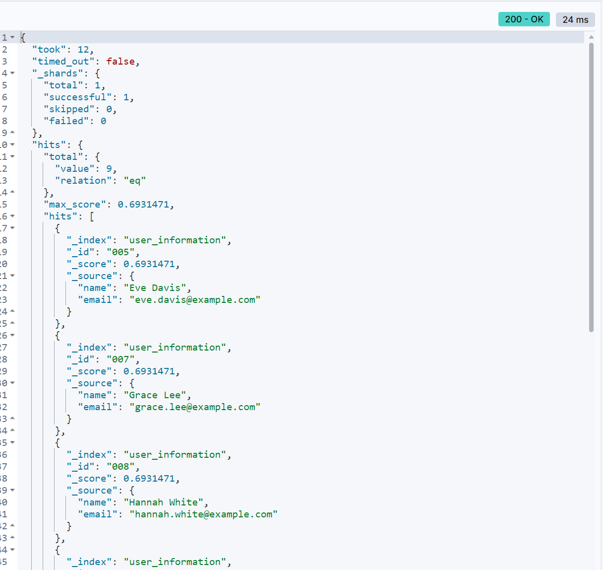
##### 2. 查找最后登录日期在2024年9月1日之后的所有活跃用户。
- ==**代码：**==
``` json
GET /user_information/_search
{
  "query": {
    "bool": {
      "must": [
        { "match": { "status": "active" } },
        { "range": { "last_login": { "gt": "2024-09-01" } } }
      ]
    }
  }
}
```
- ==**成功操作截图：**==
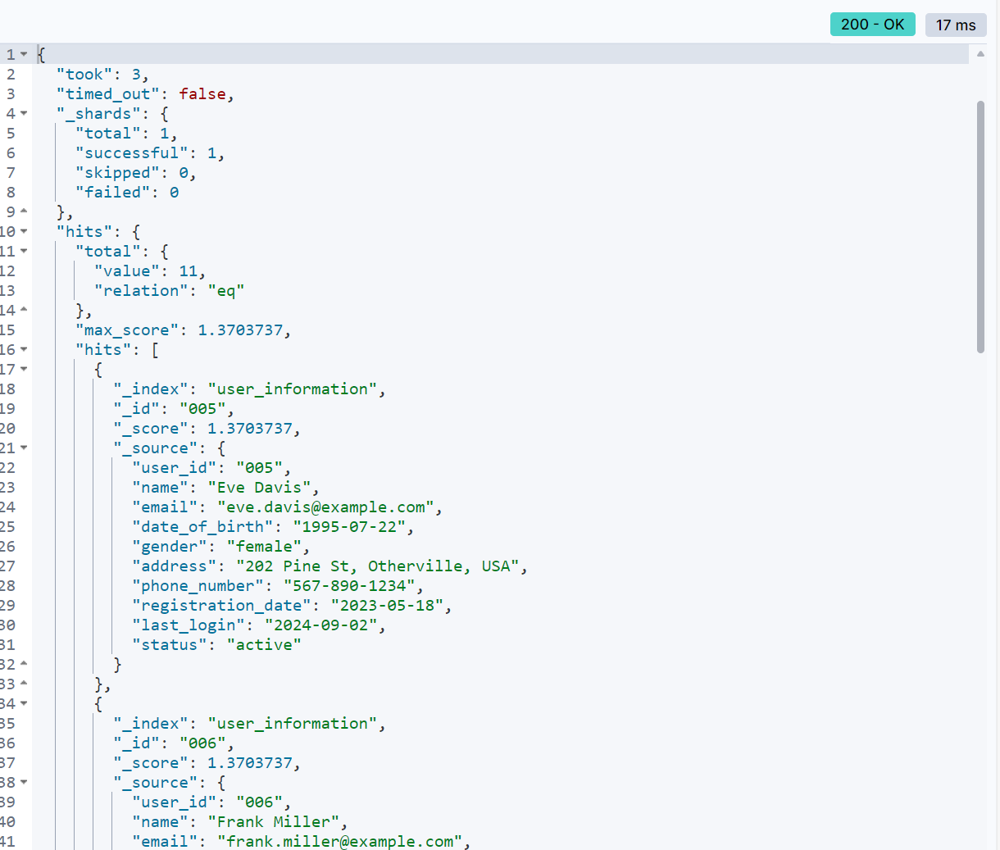
##### 3. 查询住在"Anytown"的用户。
- ==**代码：**==
``` json
GET /user_information/_search
{
  "query": {
    "match": {
      "address": "Anytown"
    }
  }
}
```
- ==**成功操作截图：**==

##### 4. 查找出生日期在1990年之后的所有用户。
- ==**代码：**==
``` json
GET /user_information/_search
{
  "query": {
    "range": {
      "date_of_birth": {
        "gt": "1990-12-30"
      }
    }
  }
}
```
- ==**成功操作截图：**==

##### 5. 查询所有状态为"inactive"的用户。
- ==**代码：**==
``` json
GET /user_information/_search
{
  "query": {
    "match": {
      "status": "inactive"
    }
  }
}
```
- ==**成功操作截图：**==

##### 6. 查找注册日期在2023年1月1日到2023年12月31日之间的用户。
- ==**代码：**==
``` json
GET /user_information/_search
{
  "query": {
    "range": {
      "registration_date": {
        "gte": "2023-01-01",
        "lte": "2023-12-31"
      }
    }
  }
}
```
- ==**成功操作截图：**==

##### 7. 查询名字为"Bob Smith"的用户的详细信息。
- ==**代码：**==
``` json
GET /user_information/_search
{
  "query": {
    "match": {
      "name": "Bob Smith"
    }
  }
}
```
- ==**成功操作截图：**==

##### 8. 查找电话号码以"123"开头的用户。
- ==**代码：**==
``` json
GET /user_information/_search
{
  "query": {
    "prefix": {
      "phone_number": "123"
    }
  }
}
```
- ==**成功操作截图：**==
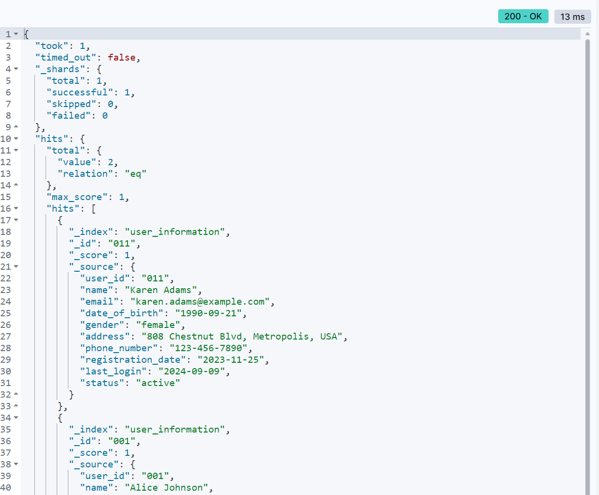
##### 9. 查询电子邮件域为"example.com"的所有用户。
- ==**代码：**==
``` json
GET /user_information/_search
{
  "query": {
    "regexp": {
      "email": "[^@]*@example\\.com"
    }
  }
}
```
- ==**成功操作截图：**==

##### 10. 查找所有名字中包含"Lee"的用户。
- ==**代码：**==
``` json
GET /user_information/_search
{
  "query": {
    "match": {
      "name": "Lee"
    }
  }
}
```
- ==**成功操作截图：**==

***
#### 3.2.产品目录数据
##### 1. 查询所有类别为"Audio"的产品名称和价格。
- ==**代码：**==
``` json
GET /product_catalog/_search?_source=name,price
{
  "query": {
    "match": {
      "category": "Audio"
    }
  }
}
```
- ==**成功操作截图：**==
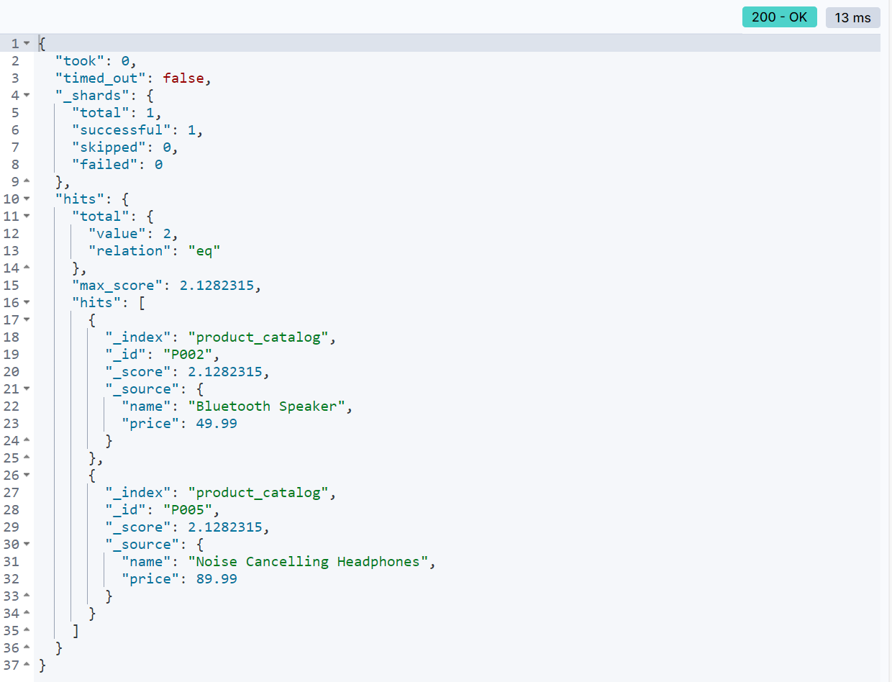
##### 2. 查找价格高于50美元的所有产品。
- ==**代码：**==
``` json
GET /product_catalog/_search
{
  "query": {
    "range": {
      "price": {
        "gt": 50
      }
    }
  }
}
```
- ==**成功操作截图：**==

##### 3. 查询库存数量少于100的产品。
- ==**代码：**==
``` json
GET /product_catalog/_search
{
  "query": {
    "range": {
      "stock_quantity": {
        "lt": 100
      }
    }
  }
}
```
- ==**成功操作截图：**==

##### 4. 查找评分高于4.5的所有产品。
- ==**代码：**==
``` json
GET /product_catalog/_search
{
  "query": {
    "range": {
      "rating": {
        "gt": 4.5
      }
    }
  }
}
```
- ==**成功操作截图：**==

##### 5. 查询标签中包含"smart"的所有产品。
- ==**代码：**==
``` json
GET /product_catalog/_search
{
  "query": {
    "match": {
      "tags": "smart"
    }
  }
}
```
- ==**成功操作截图：**==
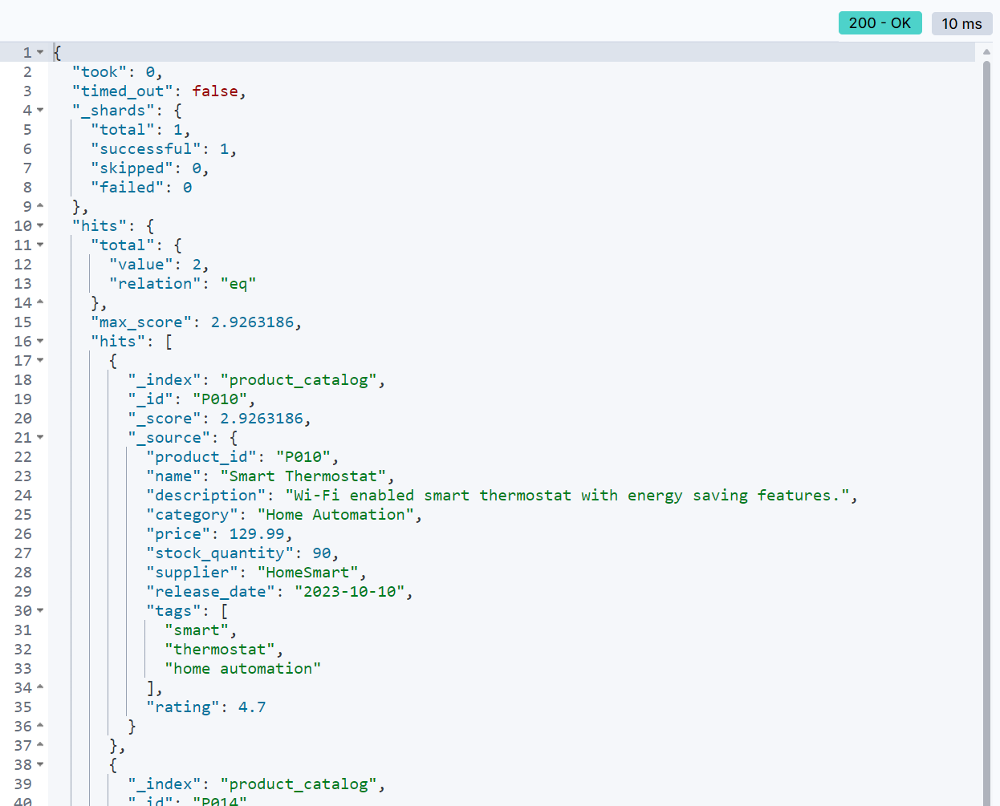
##### 6. 查找供应商为"TechCorp"的产品。
- ==**代码：**==
``` json
GET /product_catalog/_search
{
  "query": {
    "term": {
      "supplier": "TechCorp" 
    }
  }
}
```
- ==**成功操作截图：**==

##### 7. 查询发布日期在2023年6月1日之后的所有产品。
- ==**代码：**==
``` json
GET /product_catalog/_search
{
  "query": {
    "range": {
      "release_date": {
        "gt": "2023-06-01"
      }
    }
  }
}
```
- ==**成功操作截图：**==
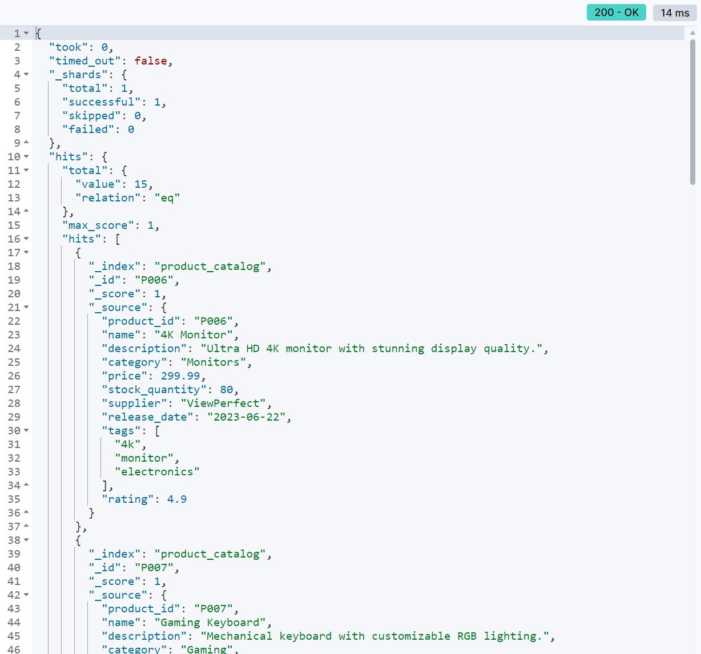
##### 8. 查找描述中包含"wireless"的产品。
- ==**代码：**==
``` json
GET /product_catalog/_search
{
  "query": {
    "match": {
      "description": "wireless"
    }
  }
}
```
- ==**成功操作截图：**==
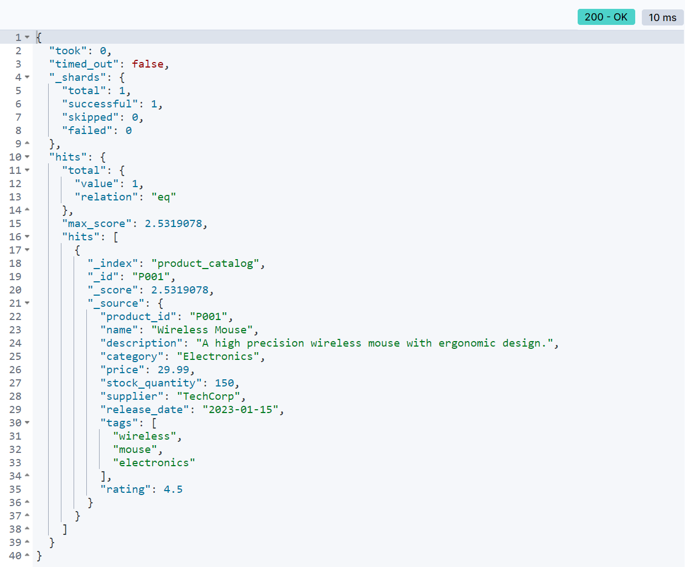
##### 9. 查询价格在20美元到100美元之间的所有产品。
- ==**代码：**==
``` json
GET /product_catalog/_search
{
  "query": {
    "range": {
      "price": {
        "gte": 20,
        "lte": 100
      }
    }
  }
}
```
- ==**成功操作截图：**==

##### 10. 查找产品名称中包含"Light"的所有产品。
- ==**代码：**==
``` json
GET /product_catalog/_search
{
  "query": {
    "match": {
      "name": "Light"
    }
  }
}
```
- ==**成功操作截图：**==
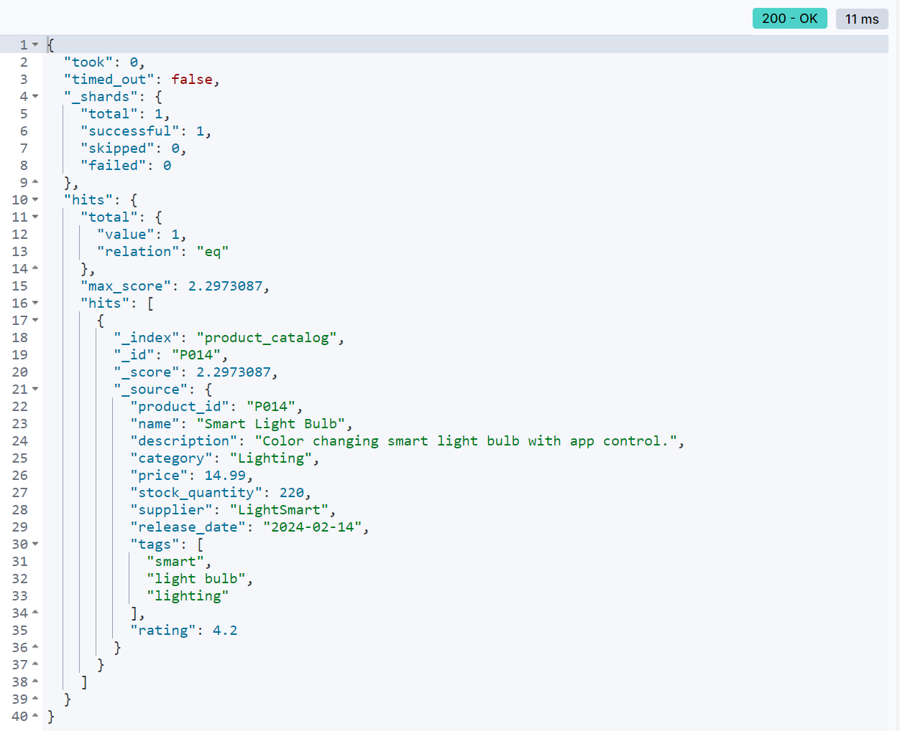
***
#### 3.3.订单记录数据
##### 1. 查询所有状态为"completed"的订单的订单ID和总金额。
- ==**代码：**==
``` json
GET /order_records/_search
{
  "query": {
    "term": {
      "status": "completed"
    }
  }
}
```
- ==**成功操作截图：**==
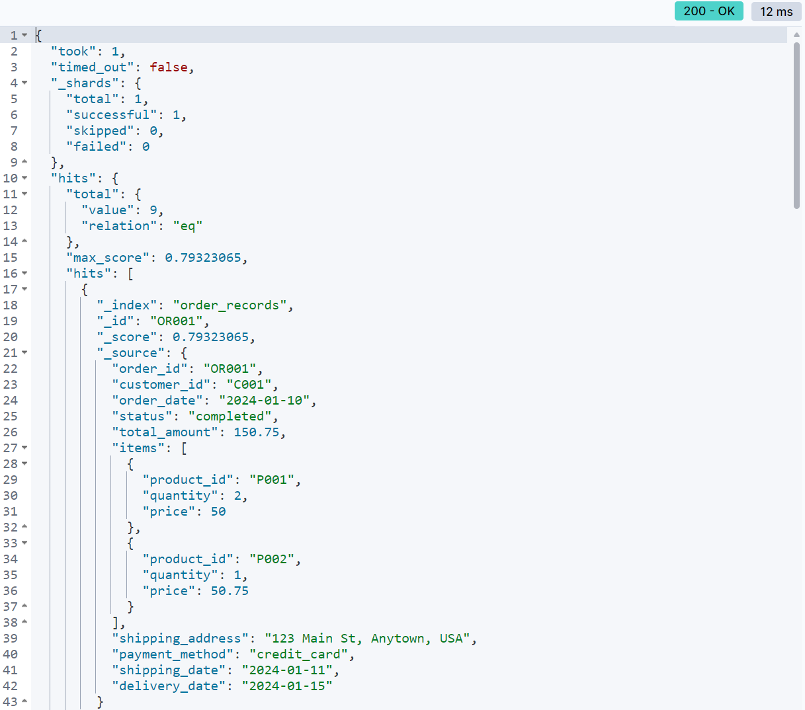
##### 2. 查找总金额大于100美元的所有订单。
- ==**代码：**==
``` json
GET /order_records/_search
{
  "query": {
    "range": {
      "total_amount": {
        "gt": 100
      }
    }
  }
}
```
- ==**成功操作截图：**==

##### 3. 查询支付方式为"paypal"的订单。
- ==**代码：**==
``` json
GET /order_records/_search
{
  "query": {
    "term": {
      "payment_method": "paypal"
    }
  }
}
```
- ==**成功操作截图：**==
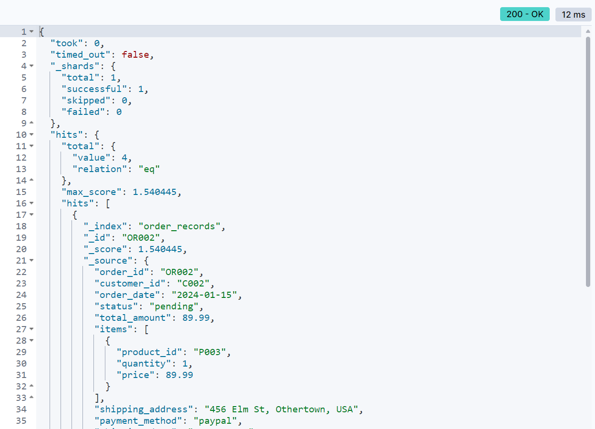
##### 4. 查找订单日期在2024年2月之后的所有订单。
- ==**代码：**==
``` json
GET /order_records/_search
{
  "query": {
    "range": {
      "order_date": {
        "gt": "2024-02-30"
      }
    }
  }
}
```
- ==**成功操作截图：**==

##### 5. 查询包含产品ID为"P001"的订单。
- ==**代码：**==
``` json
GET /order_records/_search
{
  "query": {
    "nested": {
      "path": "items",
      "query": {
        "bool": {
          "must": [
            {"match": { "items.product_id": "P001"} }
          ]
        }
      }
    }
  }
}
```
- ==**成功操作截图：**==

##### 6. 查找所有状态为"cancelled"的订单的客户ID。
- ==**代码：**==
``` json
GET /order_records/_search
{
  "query": {
    "term": {
      "status": {
        "value": "cancelled"
      }
    }
  }
}
```
- ==**成功操作截图：**==

##### 7. 查询发货日期在2024年1月15日之前的订单。
- ==**代码：**==
``` json
GET /order_records/_search
{
  "query": {
    "range": {
      "shipping_date": {
        "lt": "2024-01-15"
      }
    }
  }
}
```
- ==**成功操作截图：**==
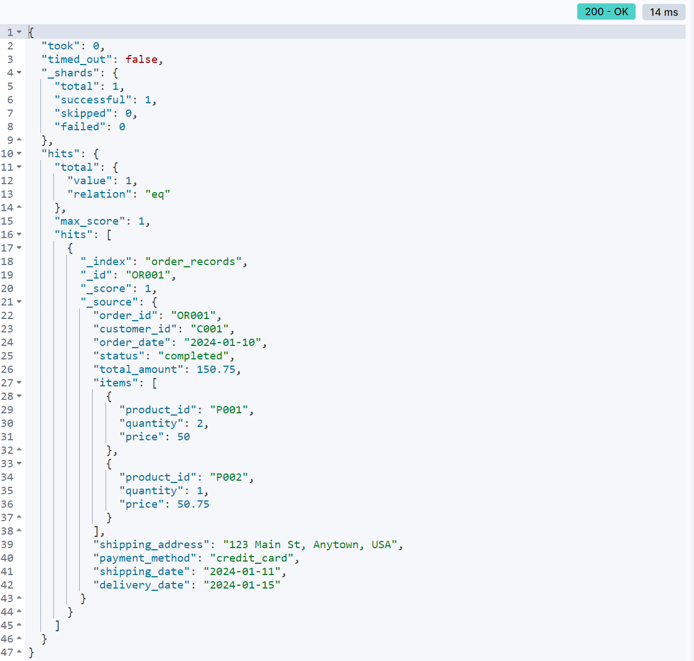
##### 8. 查找使用"credit_card"支付的订单。
- ==**代码：**==
``` json
GET /order_records/_search
{
  "query": {
    "term": {
      "payment_method": {
        "value": "credit_card"
      }
    }
  }
}
```
- ==**成功操作截图：**==

##### 9. 查询总金额在50美元到200美元之间的所有订单。
- ==**代码：**==
``` json
GET /order_records/_search
{
  "query": {
    "range": {
      "total_amount": {
        "gte": 50,
        "lte": 200
      }
    }
  }
}
```
- ==**成功操作截图：**==

##### 10. 查找订单ID中包含"OR01"的所有订单。
- ==**代码：**==
``` json
GET /order_records/_search
{
  "query": {
    "wildcard": {
      "order_id": "*OR01*"
    }
  }
}
```
- ==**成功操作截图：**==

***
## 三、问题及解决办法：
> 1、嵌套查询的写法不太了解
> 解决方法：查看文档并结合通义千问了解了嵌套的写法