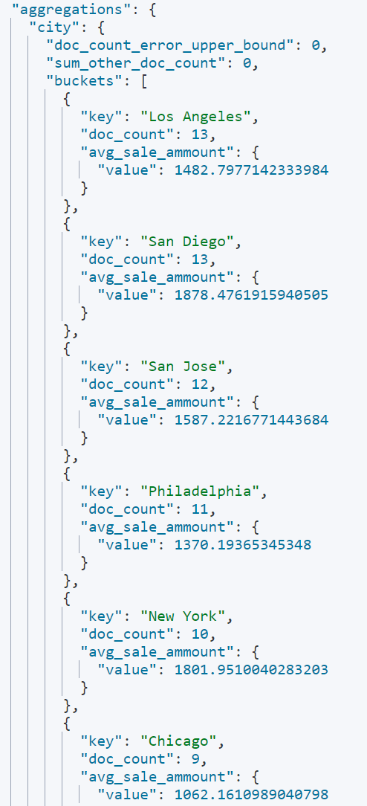

# 《实验三：聚合操作练习》

***

> **学院：省级示范性软件学院**
>
> **课程：高级数据库技术**
>
> **题目：《 实验三：聚合操作练习》**
>
> **姓名：刘顺文**
>
> **学号：2200770061**
>
> **班级：软工2202**
>
> **日期：2024-10-12**
>
> **实验环境： elasticsearch-8.12.2	kibana-8.12.2**

***

## 一、实验目的

> 1. **理解基本聚合概念：**
>
>    •学习如何使用常见的聚合类型，如 terms、sum、avg、min、max 等。
>
>    •掌握如何构造基本的聚合查询语句。
>
> 2. **数据探索：**
>
>    •通过聚合操作探索数据集中的模式和趋势。
>
>    •识别数据集中的异常值或极端情况。
>
> 3. **性能优化：**
>
>    •学习如何优化聚合查询，以减少延迟并提高查询性能。
>
>    •理解如何使用缓存来加速重复的聚合查询。
>
> 4. **多级聚合：**
>
>    •学习如何使用嵌套的聚合来构建复杂的查询。
>
>    •掌握如何组合多个聚合类型来获取更丰富的分析结果。
>
> 6. **条件过滤：**
>
>    •学习如何在聚合查询中应用过滤条件，以缩小查询范围。
>
>    •掌握如何使用 filter 和 global 聚合来提高查询效率。

***

## 二、实验内容

#### 1. 统计每个产品类别的总销售额。

##### 代码:

```json
GET /ecommerce/_search
{
  "aggs": {
    "project_type": {
      "terms": {
        "field": "product_category"
      },
      "aggs": {
        "sale_ammount": {
          "sum": {
            "field": "total_amount"
          }
        }
      }
    }
  }
}
```

##### 结果:


#### 2. 计算每个城市的平均订单金额。

##### 代码:

```json
GET /ecommerce/_search
{
  "size": 0,
  "aggs": {
    "city": {
      "terms": {
        "field": "customer_city"
      },
      "aggs": {
        "avg_sale_ammount": {
          "avg": {
            "field": "total_amount"
          }
        }
      }
    }
  }
}
```

##### 结果:



#### 3. 找出销量最高的前5个产品。

##### 代码:

```json
GET /ecommerce/_search
{
  "size": 0,
  "aggs": {
    "product": {
      "terms": {
        "field": "product_name",
        "order": {
          "total_sales": "desc"
        },
        "size": 5
      },
      "aggs": {
        "total_sales": {
          "sum": {
            "field": "quantity"
          }
        }
      }
    }
  }
}
```

##### 结果:


#### 4. 计算男性和女性客户的平均年龄。

##### 代码：

```json
GET /ecommerce/_search
{
  "size": 0, 
  "aggs": {
    "gender_type": {
      "terms": {
        "field": "customer_gender"
      },
      "aggs": {
        "avg_age": {
          "avg": {
            "field": "customer_age"
          }
        }
      }
    }
  }
}
```

##### 结果：


#### 5. 统计每种支付方式的使用次数和总金额。

##### 代码：

```json
GET /ecommerce/_search
{
  "size": 0,
  "aggs": {
    "payment_usenum": {
      "terms": {
        "field": "payment_method"
      },
      "aggs": {
        "total_amount": {
          "sum": {
            "field": "total_amount"
          }
        }
      }
    }
  }
}
```

##### 结果：


#### 6. 计算每月的总销售额。

##### 代码：

```json
GET /ecommerce/_search
{
  "size": 0,
  "aggs": {
    "month": {
      "date_histogram": {
        "field": "order_date",
        "calendar_interval": "month"
      },
      "aggs": {
        "total_sale": {
          "sum": {
            "field": "total_amount"
          }
        }
      }
    }
  }
}
```

##### 结果：


#### 7. 找出平均订单金额最高的前3个客户。

##### 代码：

```json
GET /ecommerce/_search
{
  "size": 0, 
  "aggs": {
    "customer_order": {
      "terms": {
        "field": "customer_name",
        "order": {
          "avg_spend": "desc"
        }, 
        "size": 3
      },
      "aggs": {
        "avg_spend": {
          "avg": {
            "field": "total_amount"
          }
        }
      }
    }
  }
}
```

##### 结果：


#### 8. 计算每个年龄段（18-30，31-50，51+）的客户数量。

##### 代码：

```json
GET /ecommerce/_search
{
  "size": 0, 
  "aggs": {
    "age_ranges": {
      "range": {
        "field": "customer_age",
        "ranges": [
          {
            "from": 18,
            "to": 30
          },
          {
            "from": 31,
            "to": 50
          },
          {
            "from": 51
          }
        ]
      }
    }
  }
}
```

##### 结果：


#### 9. 计算每个产品类别的平均单价。

##### 代码：

```json
GET /ecommerce/_search
{
  "size": 0, 
  "aggs": {
    "prod_category": {
      "terms": {
        "field": "product_category"
      },
      "aggs": {
        "avg_price": {
          "avg": {
            "field": "price"
          }
        }
      }
    }
  }
}
```

##### 结果：


#### 10. 找出订单数量最多的前5个城市。

##### 代码：

```json
GET /ecommerce/_search
{
  "size": 0,
  "aggs": {
    "top5_city": {
      "terms": {
        "field": "customer_city",
        "order": {
          "order_num": "desc"
        },
        "size": 5
      },
      "aggs": {
        "order_num": {
          "value_count": {
            "field": "order_id"
          }
        }
      }
    }
  }
}
```

##### 结果：


#### 11. 计算每个季度的平均订单金额。

##### 代码：

```json
GET /ecommerce/_search
{
  "size": 0, 
  "aggs": {
    "quarter": {
      "date_histogram": {
        "field": "order_date",
        "calendar_interval": "quarter"
      },
      "aggs": {
        "avg_order_price": {
          "avg": {
            "field": "total_amount"
          }
        }
      }
    }
  }
}
```

##### 结果：


#### 12. 统计每个产品类别中的商品数量。

##### 代码：

```json
GET /ecommerce/_search
{
  "size": 0, 
  "aggs": {
    "category": {
      "terms": {
        "field": "product_category"
      },
      "aggs": {
        "prod_num": {
          "value_count": {
            "field": "product_id"
          }
        }
      }
    }
  }
}
```

##### 结果：


#### 13. 计算男性和女性客户的平均订单金额。

##### 代码：

```json
GET /ecommerce/_search
{
  "size": 0, 
  "aggs": {
    "gender": {
      "terms": {
        "field": "customer_gender"
      },
      "aggs": {
        "avg_price": {
          "avg": {
            "field": "total_amount"
          }
        }
      }
    }
  }
}
```

##### 结果：


#### 14. 找出总销售额最高的前10个日期。

##### 代码：

```json
GET /ecommerce/_search
{
  "size": 0, 
  "aggs": {
    "top10_date": {
      "terms": {
        "field": "order_date",
        "order": {
          "total_amt": "desc"
        },
        "size": 10
      },
      "aggs": {
        "total_amt": {
          "sum": {
            "field": "total_amount"
          }
        }
      }
    }
  }
}
```

##### 结果：


#### 15. 计算每个季度销售额最高的产品类别。

##### 代码：

```json
GET /ecommerce/_search
{
  "size": 0, 
  "aggs": {
    "quarter": {
      "date_histogram": {
        "field": "order_date",
        "calendar_interval": "quarter"
      },
      "aggs": {
        "prod": {
          "terms": {
            "field": "product_category",
            "order": {
              "top": "desc"
            },
            "size": 1
          },
          "aggs": {
            "top": {
              "sum": {
                "field": "total_amount"
              }
            }
          }
        }
      }
    }
  }
}
```

##### 结果：


***


## 三、问题及解决办法

#### 1、嵌套聚合的使用不清楚

> 解决方法：
>
> ​	查看语雀文档，多加练习之后解决。

#### 2、使用Date Histogram 聚合的时候不知道还有季度格式

> 解决方法：
>
> ​	去网上查询了解之后解决。
